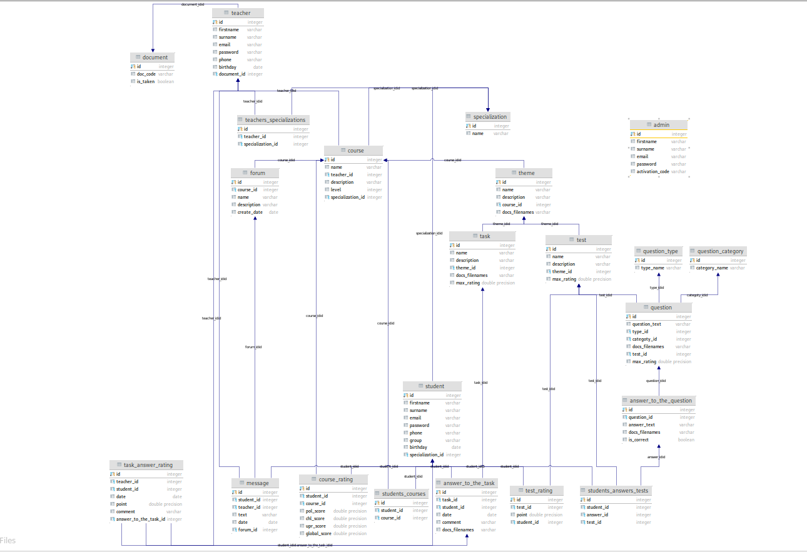
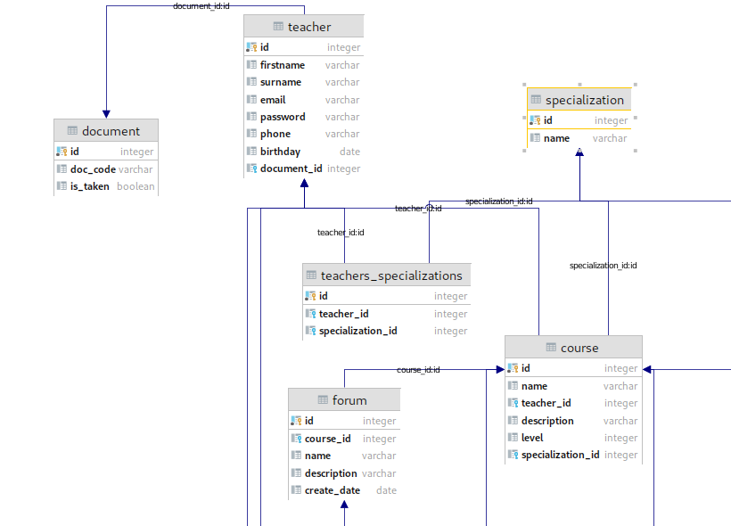
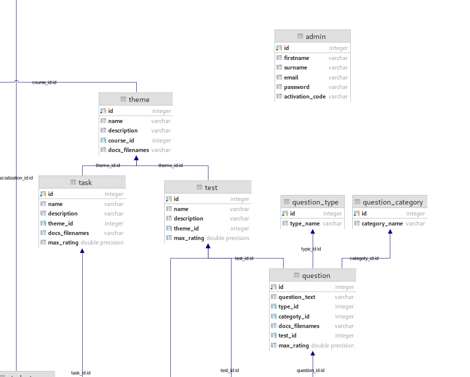
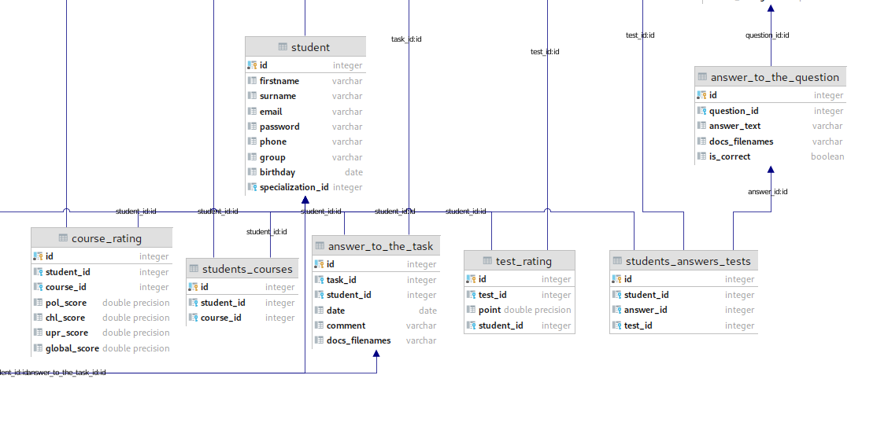
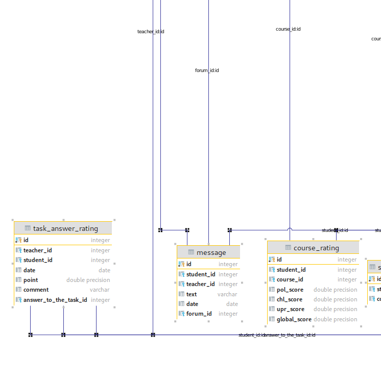

# AecDatabase
Работа с postgres и ее результаты

База получилась довольно громоздкой, но (по моему мнению) все таблицы созданы оправданно, каждая из них создана по определенной причине.
Но если вам кажется, что можно в каких то местах убрать, добавить или изменить - напишите, я признаю, что могу сделать не супер оптимизированную базу.

Основная схема:
​

Качество желает лучшего, поэтому я здесь же приложу несколько скринов отельных ее частей, чтобы увидеть мелкие детали.
​
​
​
​

В папке scripts есть весь код postgres для создания такой же базы в пару кликов.

# Курс и его составляющие (форум -> сообщение, тема -> тест, задание)

Я добавил КУРСУ такие поля как level (цифра, мы например 3 курс), так как разные курсы принадлежат разному уровню развития студента. У курса есть только один ПРЕПОДАВАТЕЛЬ. А также одна СПЕЦИАЛИЗАЦИЯ(Допустим курс "Немецкий язык" имеет ссылку специализаии "Иностранные языки").

Если рассуждать логически, КУРС состоит из ТЕМ. В нашем случае у каждого курса есть еще ФОРУМЫ.
ФОРУМЫ в свою очередь состоят из СООБЩЕНИЙ. В сообщении мы передаем id студента или преподавателя.
ТЕМЫ состоят из ТЕСТОВ и ЗАДАНИЙ.

Ремарочка: когда я говорю "состоят" я не обязываю что у каждого курса должен быть форум, тема, а у темы обязательно есть тест и задание.
Это все опционально, вы создаете курс, после в нем создаете темы по желанию, в темах помимо названия, описания и документов  можете добавить задание, если это нужно или же провести тест.

Тест состоит из вопросов и ответов и имеет внешний ключ ТЕМЫ. А ТЕМА , что логично, имеет внешний ключ КУРСА, чтобы удобно было находить и отображать все темы курса.
 У ответов есть ссылки(внешние ключи) к какому вопросу они пренадлежат. Также для удобства подсчета статистики я добавил таблицу ТИП ВОПРОСА - там всего три строки (POL, CHL, UPR), чтобы по категории можно было посчитать правильные ответы студента. Кстати про правильные ответы, они отмечаются boolean значением isCorrect. Вопросы тоже нужно сделать разные (с одним ответом, с ответом в виде строки и тд), поэтому я добавил таблицу КАТЕГОРИИ ВОПРОСОВ. А для удобства подсчетов правильных ответов студента я добавил таблицу СТУДЕНТЫ_ТЕСТЫ_ОТВЕТЫ , которая состоит из ключей студента , теста и ответа, который он выбрал. Мне кажется, так можно легче посмотреть, ведь у каждого ответа есть boolean значение isCorrect. Также при помощи сложного SELECT с JOIN можно будет посмотреть к какому ТИПУ ВОПРОСА относится ОТВЕТ который он выбрал.

Задание же тоже имеет ссылку на ТЕМУ. А также путь к документам задания.

ВАЖНАЯ ИНФА: у многих таблиц есть поле docs_filenames. Я не хотел создавать отдельную таблицу дла ДОКУМЕНТОВ, которые есть в курсе как для ТЗ задания, так и для изучения материала.
Поэтому я придумал похитрее способ. В значение docs_filenames мы будем добавлять пути через пробел. Например : "lesson1.pdf task03.doc schema.png". Потом же мы из этой строки сделаем массив строк с помощью SPLIT метода и отдельно передадим каждый путь по очереди для отображения.

Таблица ОТВЕТ НА ЗАДАНИЕ - очевидно имеет ссылку на само задание и на студента. Также в нем уже знакомое поле docs_filenames для загрузки своего решения.
После ответа идет ОЦЕНКА ОТВЕТА, где ссылки имеются на преподавателя, на ответ на задание и на студента.
Согласен! Зачем передавать студента здесь, если он есть в ОТВЕТЕ НА ЗАДАНИЕ. Сам пока не уверен в том, что правильно его туда поставил. Но, моя логика такова:
Мы считаем конечный резултат курса по результатам теста и заданий. Как то копать сначала в задание, вответ, в оценку, а потом в студента снова через ответ мне кажется сумбурно.
Но возможно в будущем отредачим здесь.

Кстати, как и тест, так и задание имеют поле с максимальным рейтингом, который указывает преподаватель при создании.
Также максимальный рейтинг имеет ВОПРОС. Чтобы удобнее было посчитать.

# Отношения между Студентами-Препдавателями и причем здесь Админ
Студенты прикрепляются к курсу, который в свою очередь принадлежит преподавателю.
Напрямую студент и преподаватель никак не связаны. Но они связываются в Оценке задания, в форуме.
Студенты могут спокойно зарегистрироваться, указав свои данные и специализацию, на которую учатся. У студента только одна специализация.
Преподаватели же могут иметь несколько специализаций, также как и специализации имеют несколько преподавателей. Поэтому тут мы создаем доп табличку СПЕЦЫ_ПРЕПОДЫ.
Преподаватель в отличии от студента не может просто так зарегистрироваться. При регистрации он должен ввести 10 значный код, который проверяется в таблице document. Это своего рода номер его преподавательского документа, чтобы кто папало не зарегистрировался. 10 знаынй код преподаватель может получить от АДМИНА. Который при трудоустройстве вносит его документ в таблицу. После проверки на подлинность у ПРЕПОДА теперь не поле документа, а ссылка на существующий документ. Сам документ помечается isTaken, чтобы тот, кто случайно найдет этот документ не мог повторно зарегистрироваться.
Я не очень уверен в АДМИНКЕ, в идеале создается отдельная таблица с РОЛЯМИ ПОЛЬЗОВАТЕЛЕЙ и просто таблица ПОЛЬЗОВАТЕЛИ, и все работает.
Но я не смог построить точно рабочую схему в голове таким методом, поэтому 3 разных таблицы для трех разных пользователей.

# Результаты курса

Вот здесь нужна будет помощь, я не совсем разобрался в критериях. Но я создал поля ОБЩИЙ РЕЙТИНГ, РЕЙТИНГ POL, РЕЙТИНГ CHL, РЕЙТИНГ UPR. для удобного подсчета.
В моей голове результат считается с помощью суммы всех заданий и тестов, где в тестах есть отметка на тип вопроса.
Эта таблица еще не заполнена и может жить самостоятельно, поэтому при желании мы можем ее отредактировать как захотим. Ближе к созданию тестов и заданий разберемся.

# Выводим данные правильно

Будет опубликовано в ночь межджу 18.04.21 - 19.04.21  
