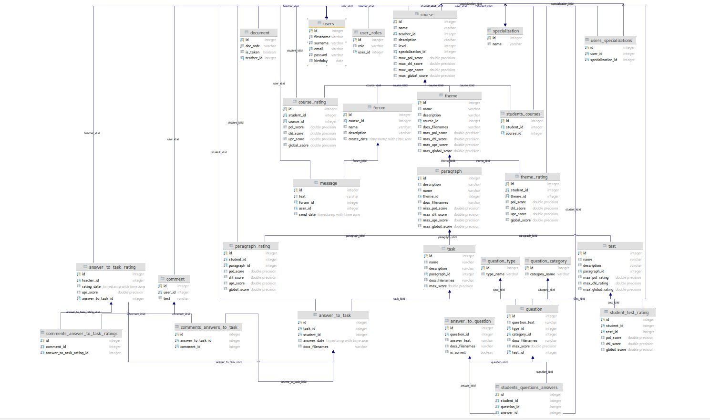

# AecDatabase

Основная модель БД
​

! Все ресурсы использовать по пути GENERAL_UPDATE !

# Начнем с самого начала (Пользователи)

Рассмотрим пользователя и его связи:
​

Можем сразу заметить, что USER связан с таблицей РОЛИ, СПЕЦИАЛИЗАЦИИ, КУРСА, ДОКУМЕНТА.

Таблица РОЛЕЙ нужна для обозначения статуса пользователя : ПРЕПОДАВАТЕЛЬ, СТУДЕНТ, АДМИНИСТРАТОРОМ.
Причем ПОЛЬЗОВАТЕЛь может быть одновременно и ПРЕПОДАВАТЕЛЕМ и АДМИНИСТРАТОРОМ, почему бы и нет.

Таблица СПЕЦИАЛИЗАЦИИ это разделение курсов и пользователей по их предметной области.
Очевидно, что у ПРЕПОДАВАТЕЛЯ может быть несколько, а у СТУДЕНТА одна.
Ничего страшного, это нам не помешает.
P.s. Мы берем связи конечно же из таблицы USERS_SPECIALIZATIONS.

Таблица КУРСА очевидно одна из важнейших, обьяснять не надо, для чего она там стоит.
У КУРСА есть отдельное поле ПРЕПОДАВАТЕЛЯ, а студенты записываются в отдельной таблице STUDENTS_COURSES,
так как и курсов несколько у студента и студентов несколько у курса.

Таблица ДОКУМЕНТА есть в доступе только у АДМИНА. Там хранятся "токены" преподавателей,
  которые пытаются подтвердить свой статус преподавателя. Они вводят токен и если он совпадает с существующим, к существующему привязывают USER_ID и отмечают is_taken, дабы исключить повторное использование.

#Перейдем к основе (Курсы и его составляющие)

Посмотрим, как это выглядит в модели:
​

Сразу видим, что у курса есть "Уровень", это поможет нам разделить наши курсы по году обучения студента.
Согласен, не самое нужное поле, но почему бы и не разделить. В будущем это может быть хорошим критерием сортировки.
Также мы видим СПЕЦИАЛИЗАЦИЮ, прямую ссылку , так как у каждого курса только одна предметная область.
Конечно же у курса должен быть явный преподаватель.

Смотрим дальше.

Видим, что получается дерево, состоящее из ветвей под названием ТЕМЫ, и лепестков под именем ПАРАГРАФЫ.
Конечно это все образно. Но иерархия присутствует.
Но, если потребуется сделать возможность создания ПАРАГРАФА из КУРСА, а не из ТЕМЫ, это (с танцами с бубном) можно будет сделать.

Тут начинаются некие повторения полей, что не есть хорошо, но в нашем случае это очевидный и легкий способ контроллировать РЕЗУЛЬТАТ СТУДЕНТА, поэтому я оставил так.
Есть идеи как сделать лучше - пишите.

Как видно, у ТЕМЫ, у ПАРАГРАФА, у КУРСА есть одни и те же поля.
Их количество может напугать, но давайте разберемся:
    3 РАЗНЫХ КРИТЕРИЯ ОЦЕНКИ
        - POL
        - CHL
        - UPR
    А значит нужно 3 критерия МАКСИМУМА этих оценок.(Сколько баллов в принципе может заработать студент)
    Значит у каждого курса, темы, параграфа есть свои 3 максимума, а у каждого результата (темы, курса, параграфа) есть 3 результата.
    Добавил глобальную(сумму) оценку чтобы каждый раз потом не считать, пригодится.

Соответственно МАКСИМУМ И ОЦЕНКА КУРСА складываются из суммы МАКСИМУМОВ И ОЦЕНОК ТЕМ, а ТЕМЫ же берут СУММЫ у ПАРАГРАФОВ.
ПАРАГРАФЫ сотоят из ТЕСТОВ И ЗАДАНИЙ, которые в свою очередь имеют также свой максимум и результат, который и считается

Вот такая рекурсия расчета выходит.     

# Как устроен ТЕСТ ?

Взглянем на модель:
​

бла бла бла

# Выводим данные правильно

  В разработке

Спасибо за внимание :)
